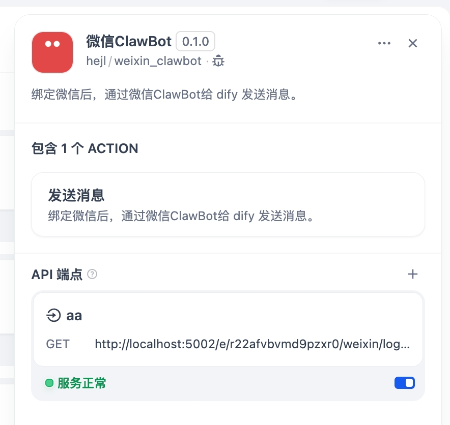
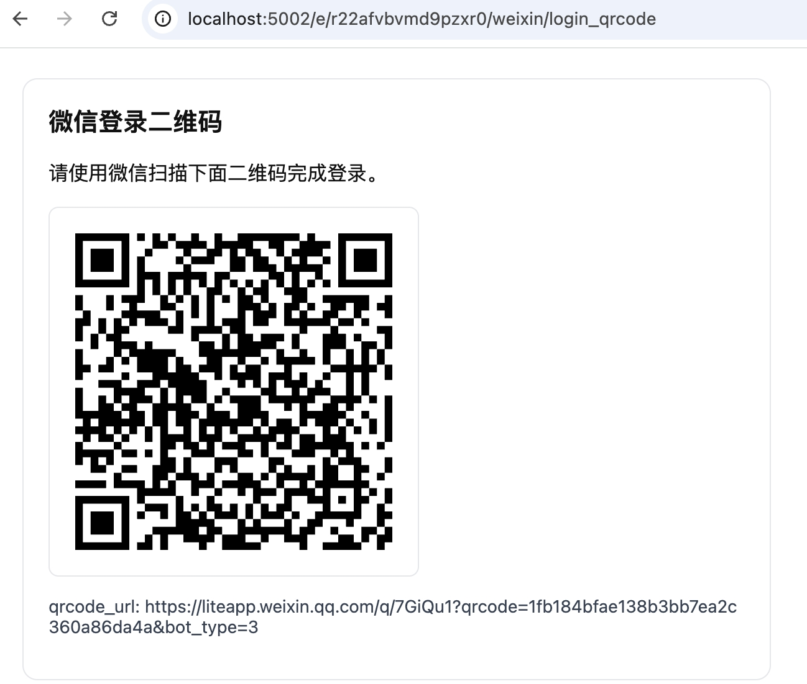
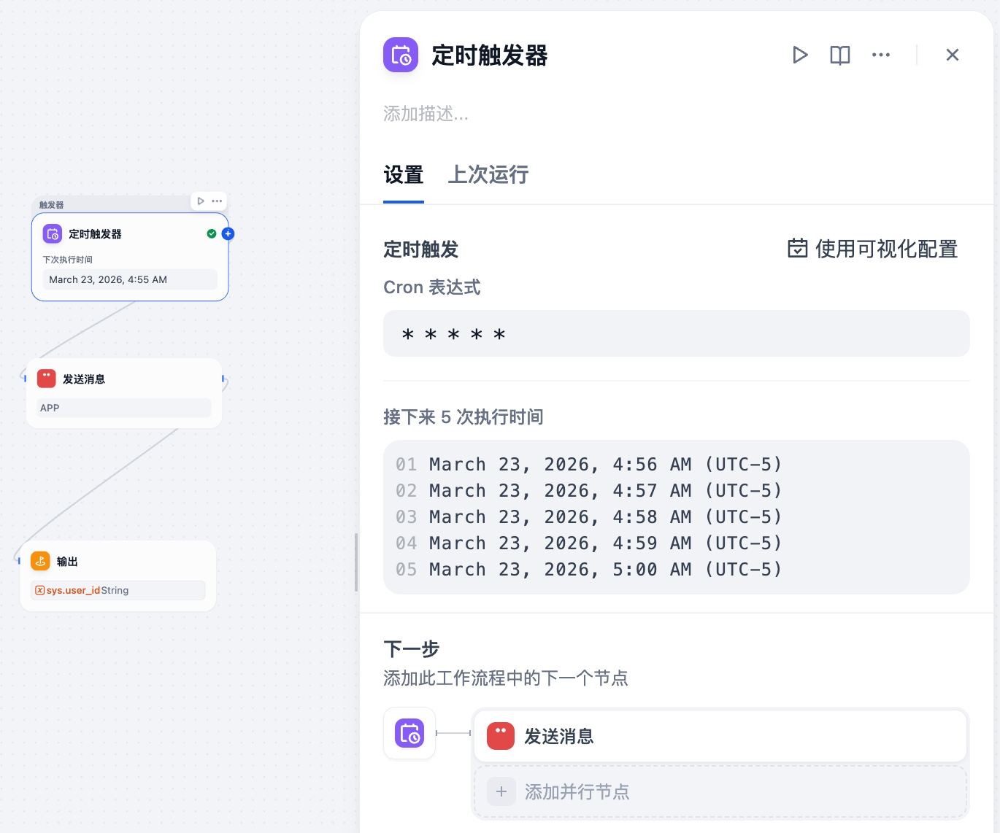
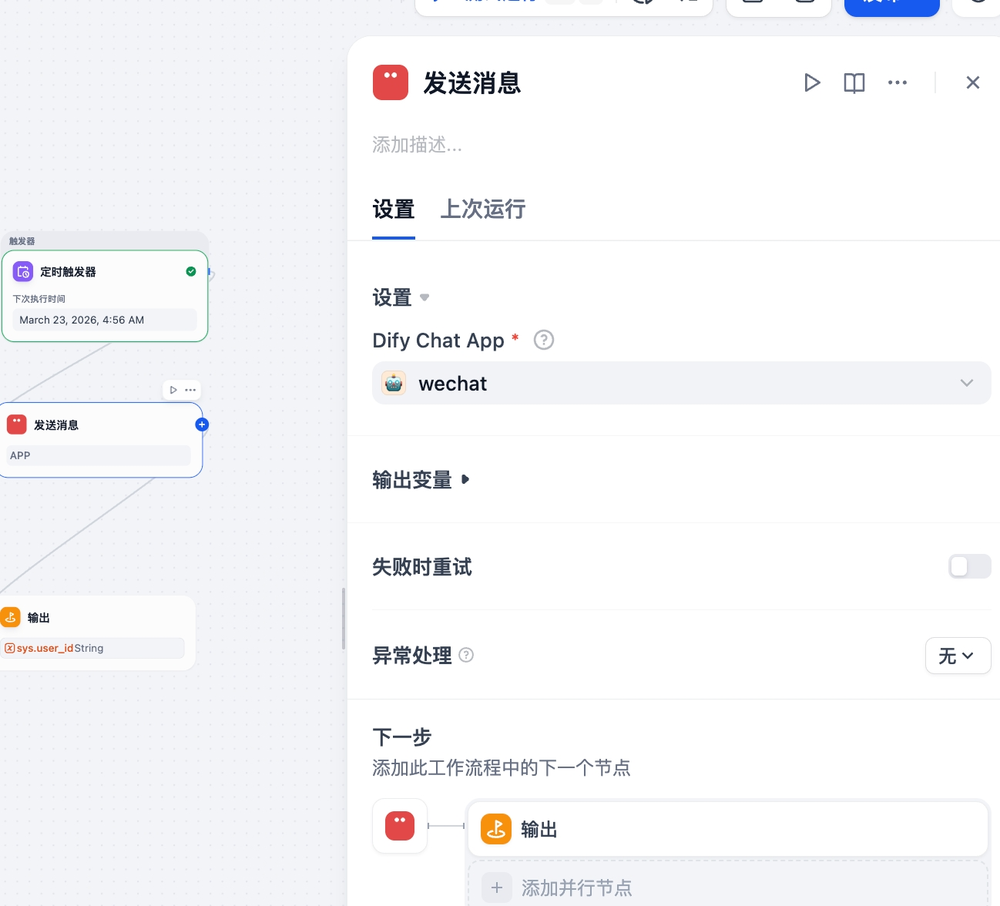
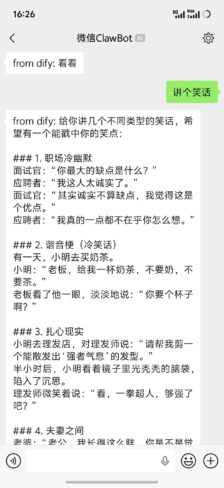

## Usage

#### 1. Create an endpoint

#### 2. Open the endpoint URL and scan the QR code to log in

#### 3. Create a scheduled workflow and set it to run once per minute

#### 4. Create a message-sending tool and choose the chat app to call

#### 5. Receive messages

